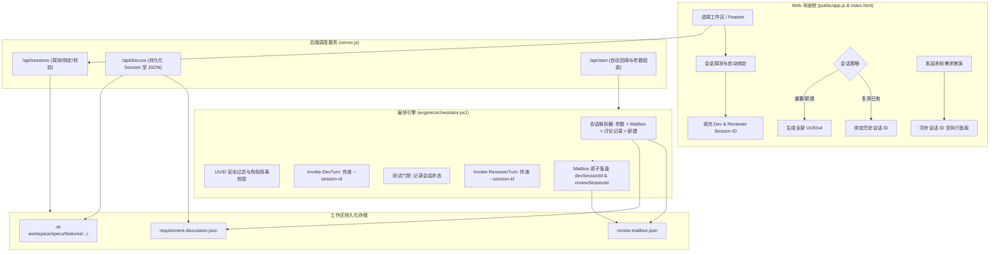

# Technical Implementation Plan & Consensus Blueprint

> **Auto-generated by Dual-Agent Studio** (2026/8/28 22:09:40)
> **Initial Requirement**: "测试会话ID自动绑定与复用"
> **Consensus State**: ✅ Consensus Reached

---

# 🛠️ Dual-Agent Studio: 测试会话 ID 自动绑定与复用技术实施方案

作为 **Lead Software Architect & Developer Agent**，针对当前本地代码仓库 [`D:\project\dual-agent-studio`](file:///D:/project/dual-agent-studio)（包含核心编排引擎 [`engine/orchestrator.ps1`](file:///D:/project/dual-agent-studio/engine/orchestrator.ps1)、轻量调度后端 [`server.js`](file:///D:/project/dual-agent-studio/server.js)、Web 驾驶舱前端 [`public/app.js`](file:///D:/project/dual-agent-studio/public/app.js) / [`public/index.html`](file:///D:/project/dual-agent-studio/public/index.html) 以及测试套件 [`tests/orchestrator.tests.ps1`](file:///D:/project/dual-agent-studio/tests/orchestrator.tests.ps1)），围绕 **“测试与执行会话 ID（Dev/Reviewer Session ID）的自动发现、跨阶段生命周期绑定、断点上下文复用与安全隔离”**，制定以下具体、高深度、可直接落地的技术方案。

---

## 1. 核心目标与架构选型 (Target Architecture & Technical Strategy)

### 1.1 现状痛点分析 (Current Gaps)
1. **跨阶段会话上下文断裂**：
   - 当前在需求对齐推演阶段（`/api/discuss`）生成的会话上下文无法自动无缝流转至执行闭环阶段（`/api/start`）；
   - 外部 CLI（如 Claude Code、Google Antigravity/AGY、GitHub Copilot CLI）均具备基于 Session ID 的上下文记忆，但在 [`server.js`](file:///D:/project/dual-agent-studio/server.js) 的 `executeDiscussionAgent` 中，仅 `copilot` 拼装了 `--session-id`，`claude` 与 `antigravity` 分支遗漏了会话参数传递，导致多轮推演丢失上下文。
2. **缺乏工作区/Feature 维度的会话自动绑定与继承**：
   - 当用户在 Web 控制台切换项目或重新加载已有任务时，前端输入框默认留空；
   - [`engine/orchestrator.ps1`](file:///D:/project/dual-agent-studio/engine/orchestrator.ps1) 在未显式传入 `-DevSessionId` 时盲目生成随机 GUID，即使该 Feature 已存在历史 `review-mailbox.json` 或 `requirement-discussion.json`，也无法自动复用历史会话，破坏了 Agent 的长期记忆。
3. **缺少会话生命周期管理与安全校验**：
   - 缺少对 Session ID 格式的正则白名单校验（防止命令注入风险）；
   - 缺少“显式复用已有会话”与“一键生成/重置全新会话”的 UI/API 控制开关。

### 1.2 目标架构与生命周期流转模型



### 1.3 核心技术策略 (Technical Strategies)
1. **多层级会话自动发现与继承阶梯 (Resolution Hierarchy)**：
   $$\text{生效 Session ID} = \text{显式入参} \gg \text{当前工作区 Mailbox 记录} \gg \text{需求讨论共识记录} \gg \text{自动生成 UUIDv4}$$
2. **全引擎 CLI 参数透传标准化**：
   - **GitHub Copilot CLI**: `--session-id=<UUID>`
   - **Claude Code CLI**: `--session-id <UUID>`（或 `--resume <UUID>`）
   - **Google Antigravity CLI (AGY)**: `--session-id <UUID>`
3. **会话双向隔离保障 (Dual-Agent Session Isolation)**：
   - 严格保证 $\text{DevSessionId} \neq \text{ReviewSessionId}$，并在引擎初始化时执行互斥断言，杜绝开发者与审查者在同一 CLI 实例中发生 Prompt 污染与角色幻觉。
4. **会话标识符安全沙箱 (Sanitization Sandbox)**：
   - 强制使用 `^[a-zA-Z0-9_-]{8,64}$` 正则校验，过滤所有非法特殊字符与 Shell 注入向量。

---

## 2. 涉及的具体文件与模块变动 (File & Module Modifications)

### 2.1 编排引擎：[`engine/orchestrator.ps1`](file:///D:/project/dual-agent-studio/engine/orchestrator.ps1)
- **新增参数**：
  - `[switch]$ForceNewSessions`：显式强制生成新会话 ID，绕过历史绑定；
  - `[switch]$AutoBindSession`（默认 `$true`）：启用工作区历史会话自动发现。
- **会话解析函数 `Resolve-EffectiveSessionId`**：
  - 优先级：显式参数 > `$effectiveMailboxPath` > `$wsPhysical/requirement-discussion.json` > `[guid]::NewGuid().ToString()`；
  - 增加安全清洗与白名单过滤：`$id -replace '[^a-zA-Z0-9_-]', ''`；
  - 增加 Dev/Reviewer ID 碰撞检测：若两者相同则强制重置 Reviewer Session。
- **`Invoke-DevTurn` & `Invoke-ReviewerTurn` 参数补全**：
  - 在 `claude` 分支中补充 `--session-id $SessionId`；
  - 在 `antigravity` 分支中补充 `--session-id $SessionId`；
  - 在 `copilot` 分支中维持 `--session-id=$SessionId` 并增强对空值的防御。

### 2.2 后端服务：[`server.js`](file:///D:/project/dual-agent-studio/server.js)
- **新增会话管理 REST API 路由**：
  - `GET /api/sessions?workspace=...&feature=...`：探测并返回指定工作区绑定的 Dev & Reviewer 历史会话 ID、来源（Mailbox / Discussion / None）及最后活跃时间；
  - `POST /api/sessions/reset`：重置并生成新的工作区会话 ID 对。
- **重构 `executeDiscussionAgent`**：
  - 修复 Claude 与 Antigravity 分支遗漏 `sessionId` 的缺陷；
  - 确保推演多轮循环中 Dev 与 Reviewer 分别使用固定的 Session ID 贯穿全程。
- **扩展 `/api/discuss` 接口**：
  - 若请求未提供 `devSessionId` / `reviewSessionId`，服务端自动生成合法的 UUIDv4 并绑定；
  - 将生成的 `devSessionId` 与 `reviewSessionId` 持久化至 `requirement-discussion.json` 与 `.ai-workspace/specs/features/<feature>/discussion-history.json` 的顶层元数据；
  - 响应体与 SSE 广播新增 `devSessionId`、`reviewSessionId` 字段。
- **增强 `/api/start` 接口**：
  - 自动回填策略：若入参无 Session ID，自动尝试读取该工作区 `requirement-discussion.json` 中的会话 ID 注入到编排引擎启动参数。

### 2.3 前端交互与视图层：[`public/index.html`](file:///D:/project/dual-agent-studio/public/index.html), [`public/app.js`](file:///D:/project/dual-agent-studio/public/app.js), [`public/style.css`](file:///D:/project/dual-agent-studio/public/style.css)
- **[`public/index.html`](file:///D:/project/dual-agent-studio/public/index.html)**：
  - 在 `#devSessionId` 与 `#reviewSessionId` 输入框旁增加“会话状态标签（Badge）”（如 `🟢 已绑定历史` / `🆕 全新会话`）；
  - 增加 `🔄 新建会话` 与 `📋 复制 ID` 快捷操作按钮。
- **[`public/app.js`](file:///D:/project/dual-agent-studio/public/app.js)**：
  - 增加 `loadWorkspaceSessions(workspaceRoot, feature)` 函数，在切换工作区或输入 Feature 时触发异步探测并自动回填输入框；
  - 需求推演完成后，自动将推演使用的 Session ID 实时绑定至主执行面板的 `#devSessionId` 和 `#reviewSessionId`；
  - 增加 `generateNewSession(role)` 前端 UUID 生成与绑定逻辑。
- **[`public/style.css`](file:///D:/project/dual-agent-studio/public/style.css)**：
  - 补充 `.session-badge`、`.session-action-btn` 与输入框内嵌操作栏样式。

### 2.4 测试套件：[`tests/orchestrator.tests.ps1`](file:///D:/project/dual-agent-studio/tests/orchestrator.tests.ps1) & 新增测试脚本
- 补充针对会话自动绑定、历史复用、强制刷新、跨引擎参数拼装以及注入字符清洗的自动化用例。

---

## 3. 可执行任务分解清单 (Actionable Subtask Checklist)

- [ ] [Task 1] **编排引擎会话解析与多引擎 CLI 参数标准化 [`engine/orchestrator.ps1`](file:///D:/project/dual-agent-studio/engine/orchestrator.ps1)**
  - 实现 `Resolve-EffectiveSessionId` 函数，支持从 `-DevSessionId`、Mailbox 文件、`requirement-discussion.json` 多级回溯；
  - 增加 `[switch]$ForceNewSessions` 强制刷新支持；
  - 增加 UUID 正则校验与安全过滤，并在 `DevSessionId == ReviewSessionId` 时自动隔离；
  - 在 `Invoke-DevTurn` 与 `Invoke-ReviewerTurn` 中，为 Claude Code（`--session-id`）、AGY（`--session-id`）、Copilot CLI 统一补全会话参数。
- [ ] [Task 2] **服务端会话探测 API 与推演上下文贯通 [`server.js`](file:///D:/project/dual-agent-studio/server.js)**
  - 注册 `GET /api/sessions` 路由，聚合读取工作区 Mailbox 与 Discussion 文件中的会话元数据；
  - 改造 `executeDiscussionAgent`，支持全 Provider 传递 `--session-id`；
  - 升级 `POST /api/discuss`：自动初始化会话 ID，落盘至 `requirement-discussion.json` 并通过 SSE 下发；
  - 升级 `POST /api/start`：未传 Session ID 时自动回填 Discussion 绑定的历史会话。
- [ ] [Task 3] **前端 Web 控制台会话自动发现、状态可视化与一键重置 [`public/app.js`](file:///D:/project/dual-agent-studio/public/app.js), [`public/index.html`](file:///D:/project/dual-agent-studio/public/index.html), [`public/style.css`](file:///D:/project/dual-agent-studio/public/style.css)**
  - 在前端 HTML 中重构 `#devSessionGroup` 与 `#reviewSessionGroup`，增加状态 Pill 与快捷按钮；
  - 在 `app.js` 实现工作区切换自动探测、推演完成自动回填、一键新建/刷新 UUID；
  - 编写 CSS 样式，展示 `已复用` / `新建` 状态提示。
- [ ] [Task 4] **自动化测试用例扩充与会话绑定回归验证 [`tests/orchestrator.tests.ps1`](file:///D:/project/dual-agent-studio/tests/orchestrator.tests.ps1)**
  - 编写用例 8：无参数时自动从已有 Mailbox 复用 Session ID；
  - 编写用例 9：使用 `-ForceNewSessions` 时忽略已有 Mailbox 并生成全新 ID；
  - 编写用例 10：Dev 与 Reviewer Session ID 冲突时的自动去重与隔离校验；
  - 编写用例 11：非法字符（特殊符号/注入字符）自动清洗测试。
- [ ] [Task 5] **系统全量验证与文档同步 [`package.json`](file:///D:/project/dual-agent-studio/package.json), [`AGENTS.md`](file:///D:/project/dual-agent-studio/AGENTS.md)**
  - 运行 `npm test` 与 `pwsh -NoProfile -File ./tests/orchestrator.tests.ps1` 确保全部绿灯；
  - 更新 [`AGENTS.md`](file:///D:/project/dual-agent-studio/AGENTS.md) 中的会话持久化与多引擎 CLI 适配规范。

---

## 4. 异常防范、边界处理与自动化测试门禁 (Edge Cases & Verification)

### 4.1 边界条件与异常防范矩阵

| 边界场景 (Edge Case) | 潜在系统风险 | 防御与自愈策略 (Defensive Mechanism) |
| :--- | :--- | :--- |
| **1. 历史文件会话 ID 损坏/非合法 UUID** | 传入 CLI 导致参数解析崩溃或挂起 | `Resolve-EffectiveSessionId` 使用正则 `^[a-zA-Z0-9_-]{8,64}$` 校验，不匹配则自动生成全新 UUID 并记录 Warn 日志 |
| **2. Dev 与 Reviewer 会话 ID 意外重名** | 两个不同角色的 Agent 共享上下文，产生角色混乱 | 初始化阶段检测 `$devId -eq $revId`，强制为 Reviewer 重新生成独立 UUID |
| **3. 跨项目切换未清空会话** | 将 Project A 的上下文注入 Project B | 前端在触发 `onWorkspaceChange` 时，通过 `/api/sessions` 重新校验工作区物理路径，隔离 LocalStorage Key 为 `session_${workspaceHash}` |
| **4. 外部 CLI 不支持 `--session-id`** | 命令行报错退出 (如旧版 CLI) | 增加 Provider 能力检测；若指定 Provider（如原生 `aider` / `cursor`）无此参数则静默忽略，不追加命令行参数 |
| **5. 注入攻击 (命令拼接风险)** | 输入恶意 Session ID 如 `abc; rm -rf /` | 编排层执行严格过滤：`$safeId = ($rawId -replace '[^a-zA-Z0-9_-]', '').Substring(0, [Math]::Min($rawId.Length, 64))` |

### 4.2 核心代码设计伪代码 (Key Code Excerpts)

#### `Resolve-EffectiveSessionId` (PowerShell 实现)
```powershell
function Resolve-EffectiveSessionId {
    param(
        [string]$ExplicitId,
        [string]$MailboxPath,
        [string]$WorkspaceRoot,
        [string]$RoleName = "dev", # "dev" or "review"
        [switch]$ForceNew
    )

    if (-not $ForceNew -and -not [string]::IsNullOrWhiteSpace($ExplicitId)) {
        return ($ExplicitId -replace '[^a-zA-Z0-9_-]', '')
    }

    if (-not $ForceNew) {
        # 1. 尝试从已有 Mailbox 读取
        if (Test-Path -LiteralPath $MailboxPath) {
            try {
                $raw = [System.IO.File]::ReadAllText($MailboxPath, [System.Text.Encoding]::UTF8)
                $mb = $raw | ConvertFrom-Json
                $candidate = if ($RoleName -eq "dev") { $mb.devSessionId } else { $mb.reviewSessionId }
                if (-not [string]::IsNullOrWhiteSpace($candidate) -and $candidate -match '^[a-zA-Z0-9_-]{8,64}$') {
                    return $candidate
                }
            } catch {}
        }
        # 2. 尝试从 requirement-discussion.json 读取
        $discPath = Join-Path $WorkspaceRoot "requirement-discussion.json"
        if (Test-Path -LiteralPath $discPath) {
            try {
                $disc = [System.IO.File]::ReadAllText($discPath, [System.Text.Encoding]::UTF8) | ConvertFrom-Json
                $candidate = if ($RoleName -eq "dev") { $disc.devSessionId } else { $disc.reviewSessionId }
                if (-not [string]::IsNullOrWhiteSpace($candidate) -and $candidate -match '^[a-zA-Z0-9_-]{8,64}$') {
                    return $candidate
                }
            } catch {}
        }
    }

    # 3. 生成新 UUID
    return [guid]::NewGuid().ToString()
}
```

### 4.3 自动化测试与门禁验证指令

在实施完成后，必须执行以下自动化门禁命令：

```powershell
# 1. 执行编排器全套测试（包含会话绑定、复用、隔离与注入清洗等用例）
pwsh -NoProfile -File ./tests/orchestrator.tests.ps1

# 2. 验证会话探测 API 响应（需启动 node server.js）
Invoke-RestMethod -Uri "http://127.0.0.1:3700/api/sessions?workspace=D:\project\dual-agent-studio"

# 3. 运行项目全局门禁测试
npm test
```

---

### 📋 审查方确认之约束与测试门禁
### 🔍 审查方评估与共识确认 (第 1 轮)

1. **架构可行性**：方案逻辑清晰，核心模块划分明确，异常处理完备；
2. **任务可执行性**：任务清单具有明确的落地路径与验证门禁。

**[VERDICT: CONSENSUS_REACHED]** 双方已达成共识，方案完备，可进入执行阶段。