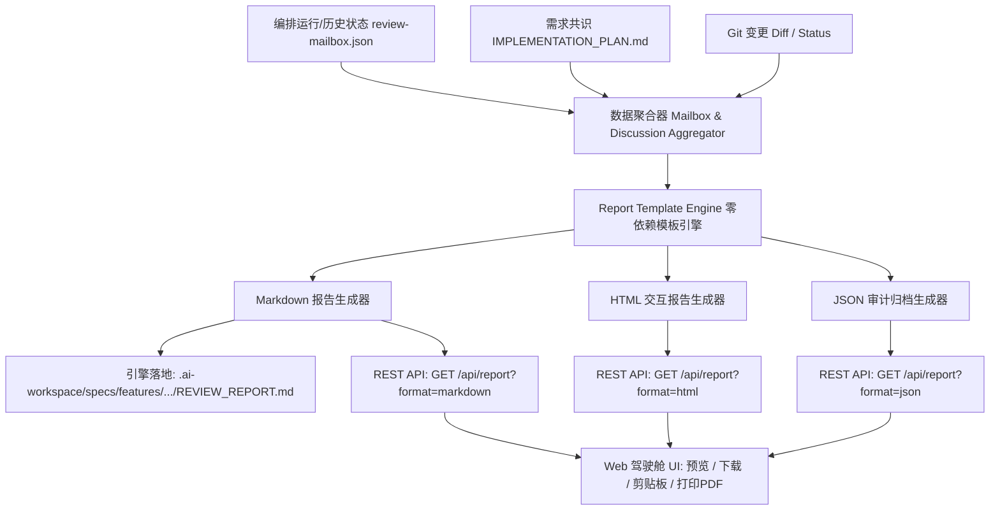

# Technical Implementation Plan & Consensus Blueprint

> **Auto-generated by Dual-Agent Studio** (2026/8/28 21:53:43)
> **Initial Requirement**: "为 Dual-Agent Studio 增加审查报告导出功能"
> **Consensus State**: ✅ Consensus Reached

---

# 🛠️ Dual-Agent Studio 审查报告导出功能技术实施方案

作为 Lead Software Architect & Developer Agent，针对 `d:\project\dual-agent-studio` 的架构特征与“为 Dual-Agent Studio 增加审查报告导出功能”的需求，制定以下切实落地、高技术深度的实施方案。

---

## 1. 核心目标与架构选型 (Target Architecture & Technical Strategy)

### 1.1 架构设计原则
1. **零外部依赖 (Zero External Dependencies)**：
   严格恪守项目核心准则，不引入任何外部 npm 包（如 `puppeteer`、`pdfkit`、`jspdf` 等）。后端报告解析与组装全部基于 Node.js 原生标准库（`fs`、`path`、`http`），前端利用原生 `Blob`、`URL.createObjectURL`、`navigator.clipboard` 以及浏览器打印 API（`window.print()` / `@media print`）实现一键导出与 PDF 打印。
2. **多格式矩阵覆盖 (Multi-Format Export Matrix)**：
   - **Markdown (.md)**：标准工程报告，符合 GitHub Flavored Markdown 规范，包含元数据摘要、严重度分布统计表、逐轮次迭代时间线、缺陷清单及 Diff 统计，可直接归档至代码仓库（如 `REVIEW_REPORT.md`）或贴入 PR/MR 描述。
   - **自包含离线 HTML (.html)**：单文件自包含（嵌入精简深色/浅色 CSS 与打印适配），支持交互式折叠、代码高亮徽章与 `@media print` 样式，在浏览器中可无损另存为 PDF。
   - **完整审计 JSON (.json)**：导出完整会话 UUID、执行参数、测试门禁日志、每轮 Prompt 与审查结论，便于 CI/CD 流水线消费与合规审计。
3. **双重触发机制 (Dual-Trigger Integration)**：
   - **引擎自动归档 (Engine Auto-Generation)**：PowerShell 编排引擎 [`engine/orchestrator.ps1`](file:///d:/project/dual-agent-studio/engine/orchestrator.ps1) 在任务终止时（`APPROVED` / `REJECTED_MAX_ROUNDS` / `FAILED`），自动在工作区 `.ai-workspace/specs/features/<feature>/` 目录下生成 `REVIEW_REPORT.md`。
   - **Web 驾驶舱按需导出 (Web Cockpit On-Demand)**：Web 端 [`public/app.js`](file:///d:/project/dual-agent-studio/public/app.js) 提供“导出报告”操作菜单，支持“复制 Markdown 到剪贴板”、“下载 Markdown”、“下载自包含 HTML”、“下载完整 JSON”及“报告弹窗预览”。



---

## 2. 涉及的具体文件与模块变动 (File & Module Modifications)

### 2.1 后端服务层：[`server.js`](file:///d:/project/dual-agent-studio/server.js)
- **新增报告合成核心函数**：
  - `buildReportData(mailbox, discussion, diffData)`：聚合工作区 Mailbox、需求对齐记录（`requirement-discussion.json`）及 Git Diff 统计指标，计算缺陷严重度分布（`CRITICAL` / `HIGH` / `MEDIUM` / `LOW`）、总轮次、测试门禁通过率等汇总指标。
  - `renderMarkdownReport(reportData)`：将聚合数据转化为标准 Markdown 字符串，格式化输出严重度汇总表、文件级缺陷表及各轮次自愈 Prompt。
  - `renderHtmlReport(reportData)`：生成包含嵌入式 CSS 与打印样式的独立 HTML 页面。
- **新增 REST API 路由**：
  - `GET /api/report`：
    - 参数：`workspace` (必填), `format` (`markdown` | `html` | `json`, 默认 `markdown`), `feature` (可选), `download` (`true` | `false`)。
    - 响应头设置：当 `download=true` 时配置 `Content-Disposition: attachment; filename="review-report-<feature>-<timestamp>.<ext>"`。
  - `POST /api/export-report`：
    - 将报告持久化写入目标工作区的 `.ai-workspace/specs/features/<feature>/REVIEW_REPORT.md` 或根目录 `REVIEW_REPORT.md`，返回文件物理路径。

### 2.2 编排引擎层：[`engine/orchestrator.ps1`](file:///d:/project/dual-agent-studio/engine/orchestrator.ps1)
- **新增函数**：`Export-ReviewReport`
  - 职责：在 Loop 正常退出（`APPROVED`）、达到轮次上限（`REJECTED_MAX_ROUNDS`）或发生中断异常（`FAILED`）时被调用。
  - 行为：读取当前 Mailbox 状态与各轮次历史记录，生成结构化 Markdown 报告并保存至 `$featureSpecDir\REVIEW_REPORT.md` 与 `$wsPhysical\REVIEW_REPORT.md`。
  - 控制台日志：以 Cyan 颜色打印 `📄 审查报告已自动归档至: <路径>`。

### 2.3 前端视图与交互层：[`public/index.html`](file:///d:/project/dual-agent-studio/public/index.html), [`public/app.js`](file:///d:/project/dual-agent-studio/public/app.js), [`public/style.css`](file:///d:/project/dual-agent-studio/public/style.css)
- **[`public/index.html`](file:///d:/project/dual-agent-studio/public/index.html)**：
  - 在顶部 Header 及 Timeline 工具栏新增 `📄 导出审查报告` 下拉按钮（包含选项：`预览报告`、`复制 Markdown`、`下载 Markdown (.md)`、`下载自包含 HTML (.html)`、`下载 JSON (.json)`）。
  - 新增 `#reportPreviewModal` 模态弹窗，提供在线预览、全屏查看与快速打印功能。
- **[`public/app.js`](file:///d:/project/dual-agent-studio/public/app.js)**：
  - 新增 `openReportModal()`、`closeReportModal()`。
  - 新增 `exportReport(format, download = true)` 与 `copyReportMarkdown()`。
  - 增强 `renderTimeline()`：在最新轮次或已完成状态下高亮报告导出入口。
- **[`public/style.css`](file:///d:/project/dual-agent-studio/public/style.css)**：
  - 新增下拉菜单 `.dropdown-menu` 样式、报告模态弹窗样式 `.report-modal`、严重度统计卡片 `.metrics-grid` 以及 `@media print` 打印优化规则。

### 2.4 测试套件：[`tests/orchestrator.tests.ps1`](file:///d:/project/dual-agent-studio/tests/orchestrator.tests.ps1)
- 新增用例 `8. Test Automated Review Report Generation`：
  - 验证运行完成后目标工作区是否正确生成 `REVIEW_REPORT.md`。
  - 验证 Markdown 报告内是否包含正确的最终结论、严重度统计和轮次历史。

---

## 3. 可执行任务分解清单 (Actionable Subtask Checklist)

- [ ] [Task 1] **后端数据聚合与模板引擎开发 (`server.js`)**
  - 实现 `buildReportData` 函数，从 `mailbox`（历史轮次、Dev 提交、Review 结论、测试门禁日志）和 `requirement-discussion.json`（讨论共识）中提取并计算统计指标（缺陷数、严重度汇总、测试通过率）。
  - 实现 `renderMarkdownReport` 与 `renderHtmlReport` 字符串渲染器，支持 HTML 特殊字符转义与代码块防溢出。
- [ ] [Task 2] **后端报告导出 REST API 接口注册 (`server.js`)**
  - 在 `server.js` 请求处理管道中注册 `GET /api/report` 和 `POST /api/export-report`。
  - 正确处理 `Content-Type`（`text/markdown; charset=utf-8`、`text/html; charset=utf-8`、`application/json`）与下载文件名编码。
- [ ] [Task 3] **编排引擎自动报告落盘机制 (`engine/orchestrator.ps1`)**
  - 实现 `Export-ReviewReport` PowerShell 辅助函数，采用 UTF-8 无 BOM 编码写入目标路径。
  - 在主循环的 `APPROVED`、`REJECTED_MAX_ROUNDS` 及 `catch` 异常分支中调用该函数，确保各种终止状态下均能产出报告。
- [ ] [Task 4] **前端 UI 组件与导出下拉菜单 (`public/index.html`, `public/style.css`)**
  - 在顶部工具栏和轮次流转面板添加导出按钮组件与下拉浮层。
  - 构建 `#reportPreviewModal` 模态窗结构，并增加报告预览容器与操作按钮组。
  - 在 `style.css` 中增加指标仪表盘网格样式、打印样式及响应式适配。
- [ ] [Task 5] **前端交互与文件下载控制器 (`public/app.js`)**
  - 实现前端数据请求、剪贴板复制（`navigator.clipboard.writeText`）、本地 Blob 下载（`downloadBlobFile`）逻辑。
  - 实现报告模态弹窗的动态内容渲染与打印功能。
- [ ] [Task 6] **自动化测试用例补充与验证 (`tests/orchestrator.tests.ps1`)**
  - 在自动化测试脚本中增加对报告生成完整性、缺陷聚合正确性以及多轮自愈历史记录的断言。

---

## 4. 异常防范、边界处理与自动化测试门禁 (Edge Cases & Verification)

### 4.1 边界条件与异常防范
1. **空状态与中间态导出处理**：
   - 当任务尚在运行（`WAITING_DEV` / `WAITING_REVIEW`）或工作区未初始化时，报告生成器自动标记状态为 `IN_PROGRESS` 或 `INITIALIZED`，并将当前正在进行的轮次加入报告草稿，避免报空指针或崩溃。
2. **特殊字符与 XSS/Markdown 注入防御**：
   - Reviewer 输出的缺陷描述、代码片段与测试日志可能包含 HTML 标签、双引号或反引号。HTML 报告渲染时对文本内容执行严苛的 `escapeHtml` 转义，对 Markdown 中的代码块使用安全的栅格隔离。
3. **大日志截断与内存保护**：
   - 若测试输出（`testOutput`）或 Git Diff 过大（> 1MB），在报告中保留前 100 行摘要并注明 `[Output Truncated for Report Compactness]`，防止浏览器端内存暴涨。
4. **工作区目录权限与文件回滚安全**：
   - 写入 `REVIEW_REPORT.md` 时采用临时文件替换机制（写入 `.tmp_<guid>` 后原子重命名），防止写入中断导致文件损坏。

### 4.2 自动化测试与门禁验证指令

在完成代码修改后，依次执行以下测试门禁命令，确保所有测试用例 100% 通过且无回归风险：

```powershell
# 1. 运行 PowerShell 编排器自动化全套测试（包含单轮、多轮自愈、崩溃拦截与报告生成用例）
pwsh -NoProfile -File ./tests/orchestrator.tests.ps1

# 2. 启动服务进行本地端到端与 API 验证
node server.js
```

**API 快速验证测试命令**（在另一个终端执行）：
```powershell
# 验证 Markdown 格式报告导出
Invoke-RestMethod -Uri "http://127.0.0.1:3700/api/report?workspace=d:\project\dual-agent-studio&format=markdown"

# 验证 HTML 格式报告导出
Invoke-RestMethod -Uri "http://127.0.0.1:3700/api/report?workspace=d:\project\dual-agent-studio&format=html"

# 验证 JSON 格式审计数据导出
Invoke-RestMethod -Uri "http://127.0.0.1:3700/api/report?workspace=d:\project\dual-agent-studio&format=json"
```

---

### 📋 审查方确认之约束与测试门禁
I'll examine the actual codebase to ground my review in the real implementation details (mailbox schema, existing server.js routes, orchestrator structure).

## Review Findings (grounded in actual code)

**1. Duplicate Markdown/HTML rendering logic → drift risk.** The plan implements `renderMarkdownReport`/`renderHtmlReport` in `server.js` (JS) **and** a separate `Export-ReviewReport` in `orchestrator.ps1` (PowerShell). Two independent renderers of the same mailbox schema will silently diverge as the schema evolves (e.g., `issues[].severity`, `history[]` shape). Recommend extracting a single zero-dependency `scripts/report-template.js`, invoked both from `server.js` (require) and from `orchestrator.ps1` (via `node scripts/report-template.js <mailboxPath> <format>`, since `node` is already a hard runtime dependency of this project) — one source of truth.

**2. Path-resolution reuse gap.** `server.js` already has `getMailbox(workspaceRoot, customMailboxPath, feature)` implementing the feature-dir → `.ai-sop` → root fallback chain. `buildReportData` must call this exact helper, not reimplement resolution — otherwise report data can point at a different mailbox than `/api/status` shows.

**3. Discussion-file naming mismatch (concrete bug source).** Actual code writes discussion data as `requirement-discussion.json` at workspace root but `discussion-history.json` inside `.ai-workspace/specs/features/<feature>/`. The plan only names `requirement-discussion.json` — as written, `buildReportData` will silently miss discussion context for feature-scoped runs.

**4. Zero automated coverage for the new Node code.** `package.json`'s `test` script runs only `tests/orchestrator.tests.ps1`. The plan's Task 6 adds one PowerShell case for the *engine's* auto-archive, but `buildReportData`/`renderMarkdownReport`/`renderHtmlReport`/the two REST routes have no repeatable gate — section 4.2's `Invoke-RestMethod` commands are manual and never re-run. Required: a pure Node assertion script (e.g. `scripts/test-report.js`) exercising the exported functions against a synthetic mailbox fixture (asserting severity aggregation, HTML-escaping of injected `<script>`/backtick content, truncation), wired into `npm test`.

**5. Root-level multi-feature collision.** When no `.ai-workspace/specs/features/<feature>` dir exists, both the API and the engine fall back to a single un-namespaced `REVIEW_REPORT.md` at workspace root — two concurrent feature runs against the same workspace will overwrite each other's report. Always namespace by feature name.

**6. Null-mailbox crash path unaddressed on the engine side.** Edge-case handling (§4.1.1) is specified only for the API; if the orchestrator throws before `Write-MailboxState` ever runs (e.g., `WORKSPACE_NOT_FOUND`), `Export-ReviewReport` in the `catch` block receives a null mailbox and isn't guarded.

**7. CJK filenames in `Content-Disposition`.** Feature names are frequently Chinese in this project; plain `filename="..."` will mangle non-ASCII. Needs RFC 5987 `filename*=UTF-8''%E2%80%A6` encoding.

**[VERDICT: NEEDS_REFINEMENT]**

Developer must, before implementation: (a) collapse the Markdown/HTML renderer into one shared module callable from both Node and PowerShell; (b) reuse `getMailbox()` verbatim and check both `requirement-discussion.json` and `discussion-history.json` locations; (c) always namespace `REVIEW_REPORT.md` by feature; (d) add a concrete, `npm test`-wired Node assertion script for the new rendering functions (not just manual curl checks); (e) guard `Export-ReviewReport` against a null/uninitialized mailbox; (f) use RFC 5987 filename encoding for non-ASCII feature names in `Content-Disposition`.